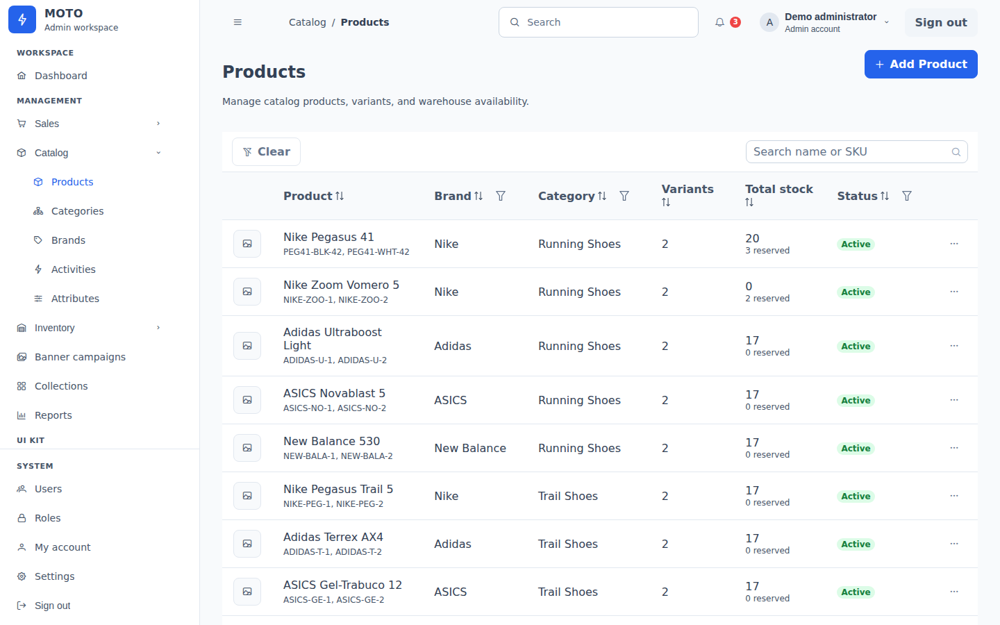
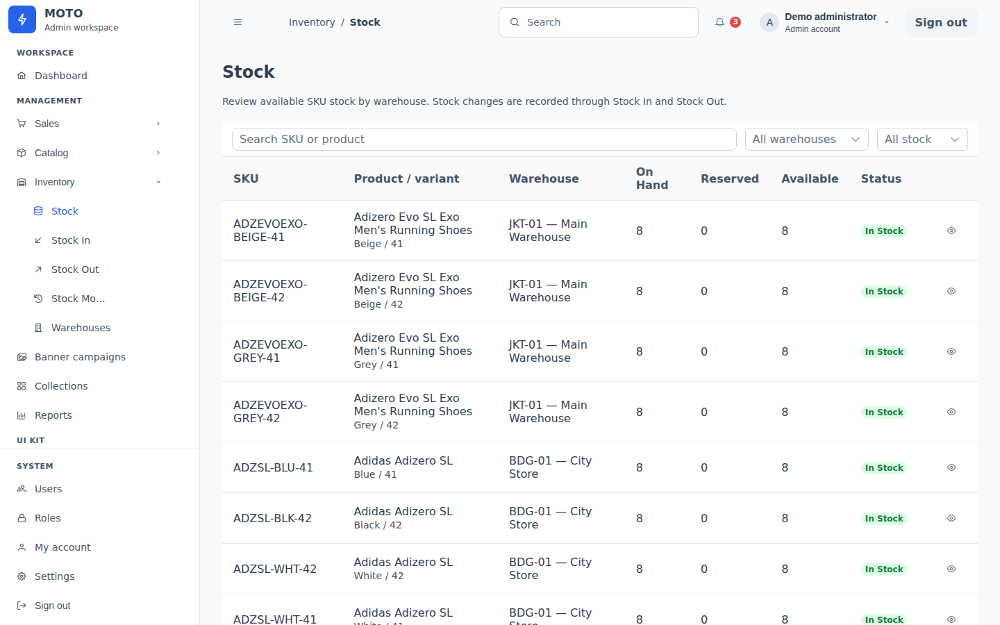
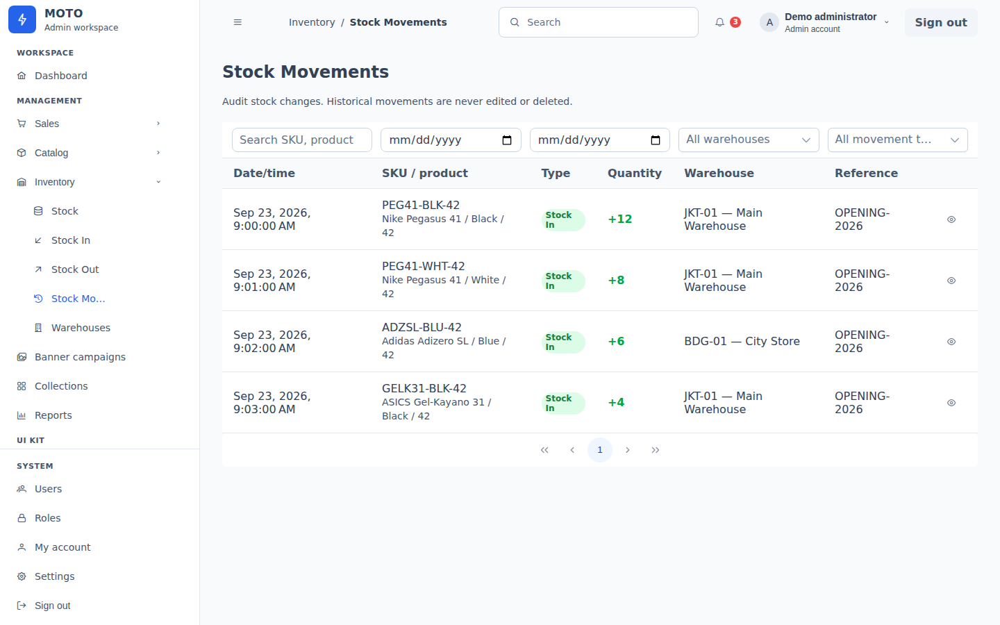

# Dashboard Admin — mengelola katalog dan operasi toko

**Peran proyek:** pengembangan frontend dan integrasi API simulasi  
**Cakupan:** pengelolaan produk, inventori, pesanan, dan konten storefront

## Pengalaman pengelola

Area admin menyediakan halaman terpisah untuk produk, varian, kategori, brand, aktivitas, dan atribut. Status publikasi menentukan produk yang muncul di e-commerce publik. Banner kampanye dan pilihan produk unggulan juga dapat diatur tanpa mengubah kode storefront.

Inventori ditampilkan per SKU dan gudang dengan jumlah *on hand*, *reserved*, dan *available*. Pengelola dapat mencatat Stock In atau Stock Out dan meninjau riwayat pergerakan stok. Daftar pesanan dapat dicari dan difilter menurut kanal, status pesanan, serta status pembayaran; detail pesanan menampilkan item dan riwayat status. Admin juga memiliki alur membuat pesanan.

**Alur:** Atur produk dan konten → cek stok per SKU/gudang → catat stok masuk atau keluar → tinjau riwayat → cari pesanan dan perbarui status sesuai alur yang tersedia.

## Tampilan admin

*Daftar produk merangkum varian, status publikasi, dan stok sebelum pengelola membuka detail atau mengeditnya.*

*Inventori dibaca pada tingkat SKU dan gudang, termasuk jumlah yang tersedia untuk dijual.*

*Riwayat pergerakan memberi konteks kapan dan di mana stok berubah.*

## Implementasi

Admin dibuat dengan Angular 21, TypeScript, dan feature routes yang dimuat secara lazy. PrimeNG Aura menyediakan tabel, form, dan kontrol backoffice. Data katalog dan inventori memakai layanan bersama dengan storefront publik, sehingga perubahan yang tersimpan pada API Mockoon dapat tercermin di kedua sisi selama instance berjalan.

Ini adalah demo portofolio: autentikasi admin pada mock bersifat simulasi dan data kembali ke seed ketika Mockoon dimulai ulang. Screenshot dashboard ringkasan tidak disertakan karena sebagian metrik pada seed demo belum selaras dengan katalog olahraga; showcase admin menampilkan halaman operasional yang datanya relevan.
