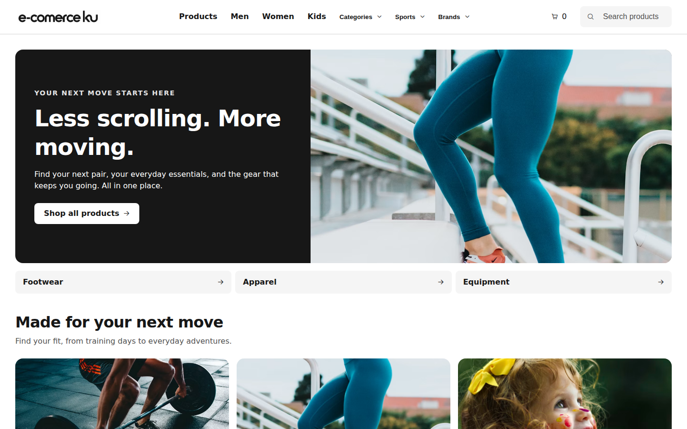
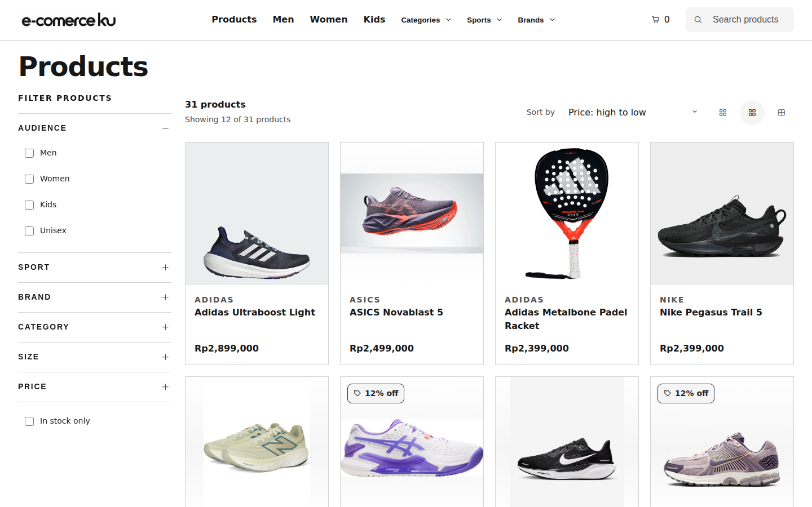
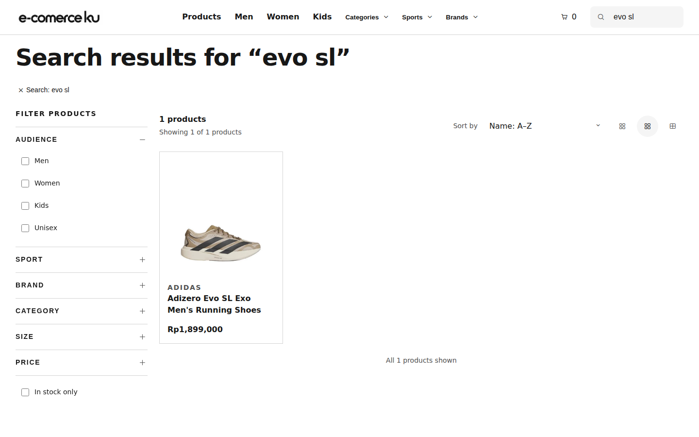
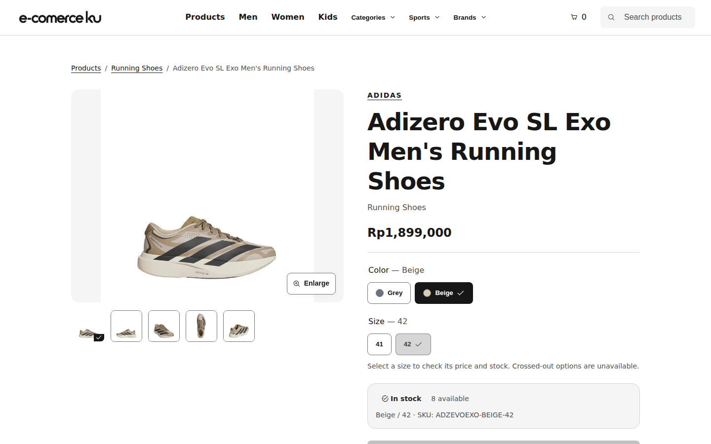
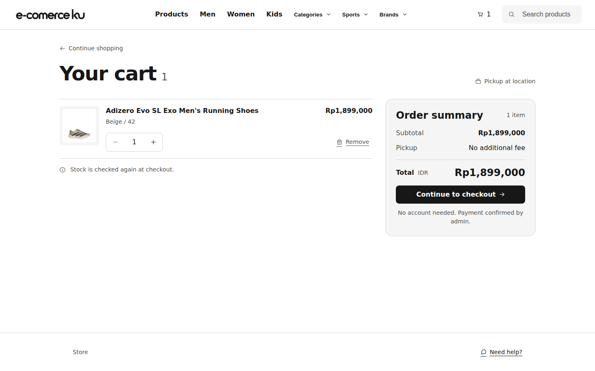
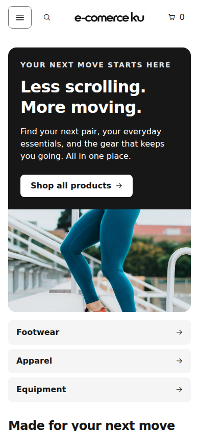
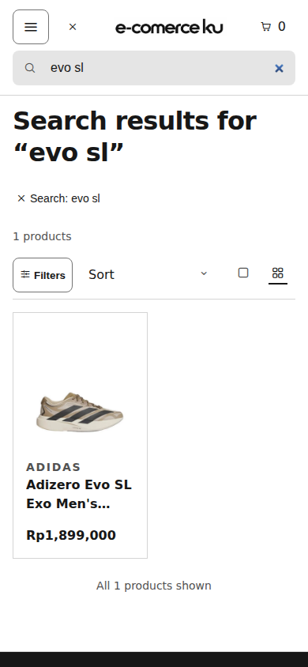
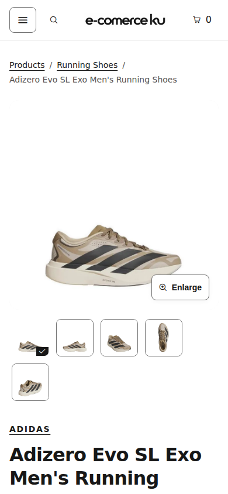
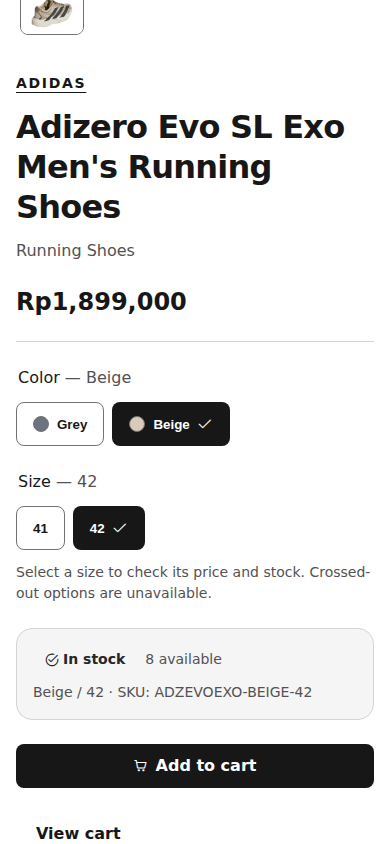

# E-Commerce Publik — dari penemuan produk hingga pesanan demo

*Homepage desktop membuka akses ke kategori, aktivitas, brand, dan produk unggulan sejak layar pertama.*

**Peran proyek:** pengembangan frontend dan integrasi API simulasi  
**Cakupan:** storefront responsif, detail produk berbasis varian, keranjang, dan checkout tamu

## Pengalaman pelanggan

Pengunjung dapat masuk melalui kampanye homepage, menjelajahi katalog, mencari produk, lalu mempersempit hasil dengan filter audiens, olahraga, brand, kategori, ukuran, harga, dan stok. Filter dan urutan tersimpan di URL agar hasil dapat dibuka kembali atau dibagikan.

Halaman detail menampilkan galeri, pilihan warna dan ukuran, harga, SKU, serta ketersediaan untuk varian yang dipilih. Kombinasi yang tidak tersedia dicegah sebelum produk masuk ke keranjang. Pelanggan dapat mengubah jumlah barang, mengisi kontak, meninjau ringkasan, lalu membuat pesanan demo tanpa akun. Stok diperiksa lagi saat checkout; pembayaran menunggu konfirmasi admin.

**Alur:** Homepage → katalog atau pencarian → filter → detail produk → pilih varian → keranjang → kontak → tinjau dan buat pesanan demo.

## Tampilan desktop

*Listing menempatkan filter dan urutan di dekat hasil katalog.*

*Pencarian mengarahkan pelanggan ke produk Adizero Evo SL Exo.*

*Detail produk menghubungkan pilihan ukuran dengan SKU dan stok yang tersedia.*

*Keranjang memperlihatkan produk yang dipilih, pengatur jumlah, dan langkah menuju checkout.*

## Tampilan mobile

*Navigasi dan kampanye homepage menyesuaikan lebar layar ponsel.*

*Hasil pencarian tetap dapat dijelajahi pada layar sempit, dengan kontrol filter yang sesuai untuk mobile.*

*Galeri dan identitas produk tersusun dalam satu kolom.*

*Pilihan ukuran, stok, dan aksi pembelian mengikuti galeri dalam urutan baca yang jelas.*

## Implementasi

Storefront dibuat dengan Angular 21 dan TypeScript. Feature routes dimuat secara lazy, state lokal menggunakan Signals, dan komponen bersama menjaga pola kartu produk, galeri, kontrol varian, form, serta state UI tetap konsisten. Tailwind CSS memakai design tokens semantik untuk tampilan publik.

Katalog, stok, pesanan, dan konten berasal dari API Mockoon. Keranjang tamu disimpan di browser. Ini adalah demo portofolio: data Mockoon kembali ke seed saat instance dimulai ulang, sedangkan pembayaran dan pengiriman nyata belum diimplementasikan. Pesanan publik dibuat dengan metode pickup.
